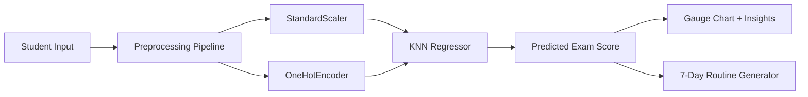

# 🎓📚 STUDYBUDDY — STUDENT PERFORMANCE ANALYZER 📚🎓

[](https://git.io/typing-svg)


[](https://student-performance-analyzer-project.streamlit.app/)
[](https://github.com/mayank-goyal09/student-performance-analyzer/stargazers)
[](https://github.com/mayank-goyal09/student-performance-analyzer/network)


### 🎯 **Predict exam scores like an academic advisor** using **KNN + ML Pipeline** 🤖
### 📊 Student Data × AI = **Academic Intelligence** 💡

---

## 🌟 **WHAT IS THIS?** 🌟

<table>
<tr>
<td>

### 🎓 **The Magic**

This **ML-powered student performance predictor** analyzes behavioral and demographic data using **KNN Regression** with **GridSearchCV hyperparameter tuning** to predict exam scores. Upload your profile and get instant predictions + personalized 7-day study routines!

**Think of it as:**
- • 🧠 Brain = KNN Regression Model
- • 📊 Input = Study Habits + Demographics
- • 🎯 Output = Predicted Exam Score

</td>
<td>

### ⚡ **Key Features**

✅ KNN Regression with hyperparameter tuning  
✅ Industry-grade ML pipeline (preprocessing + model)  
✅ Permutation feature importance analysis  
✅ Interactive gauge chart predictions  
✅ **7-Day study routine generator** 🗓️  
✅ Beautiful Streamlit UI with mobile support  

**Performance Metrics:**
- 📉 **MAE**: 6.89
- 📊 **RMSE%**: ~17.44%
- 🎯 **R²**: High predictive accuracy

</td>
</tr>
</table>

---

## 🛠️ **TECH STACK** 🛠️


| **Category** | **Technologies** |
|---|---|
| 🐍 **Language** | Python 3.8+ |
| 📊 **Data Science** | Pandas, NumPy, Scikit-learn |
| 🎨 **Frontend** | Streamlit |
| 📈 **Visualization** | Plotly, Matplotlib, Seaborn |
| 🧪 **Model** | KNN Regressor, GridSearchCV, Pipeline |
| 🔧 **Preprocessing** | StandardScaler, OneHotEncoder, ColumnTransformer |
| 💾 **Serialization** | Joblib |

---

## 📂 **PROJECT STRUCTURE** 📂

```
🎓 student-performance-analyzer/
│
├── 📁 app.py                           # Streamlit web application
├── 📁 main.ipynb                       # Model training, EDA & hyperparameter tuning
├── 📦 requirements.txt                 # Dependencies
├── 💾 student_performance_knn.joblib   # Trained KNN model
├── 💾 student_knn_pipeline.joblib      # Complete ML pipeline (preprocessing + model)
├── 📊 Exam_Score_Prediction.csv        # 20,000 student records dataset
├── 🔒 .gitignore                       # Git ignore file
├── 📜 LICENSE                          # MIT License
└── 📖 README.md                        # You are here!
```

---

## 🚀 **QUICK START** 🚀


### **Step 1: Clone the Repository** 📥

```bash
git clone https://github.com/mayank-goyal09/student-performance-analyzer.git
cd student-performance-analyzer
```

### **Step 2: Install Dependencies** 📦

```bash
pip install -r requirements.txt
```

### **Step 3: Run the App** 🎯

```bash
streamlit run app.py
```

### **Step 4: Open in Browser** 🌐

The app will automatically open at: **`http://localhost:8501`**

---

## 🎮 **HOW TO USE** 🎮

<table>
<tr>
<td>

### 🔹 **Quick Prediction Mode**

1. Open the app
2. Fill in student profile:
   - Study hours, class attendance, motivation level
   - Previous scores, parental involvement
   - Demographics (gender, part-time job, etc.)
3. Click **"Predict Score"**
4. View predicted exam score with gauge chart!

</td>
<td>

### 🔹 **7-Day Routine Generator** 🗓️

1. Predict your score first
2. Navigate to **"7-Day Routine Generator"**
3. Select:
   - Available study time
   - Exam type
   - Focus areas
4. Generate personalized study plan
5. Download routine as PDF (future feature)

</td>
</tr>
</table>

---

## 🧪 **HOW IT WORKS** 🧪



### **Pipeline Breakdown:**

1️⃣ **Data Upload** → Student profile with 15+ features  
2️⃣ **Preprocessing** → ColumnTransformer applies:
   - StandardScaler for numeric features
   - OneHotEncoder for categorical features  
3️⃣ **Model Inference** → KNN Regressor predicts exam score  
4️⃣ **Feature Importance** → Permutation importance shows impact  
5️⃣ **Visualization** → Plotly gauge chart + bar charts  
6️⃣ **Routine Generator** → AI-powered 7-day study plan

---

## 📊 **DATASET & FEATURES** 📊


### **Dataset Overview**

- **Source**: Kaggle Student Performance Dataset
- **Size**: 20,000 student records
- **Target Variable**: `exam_score` (0-100)

### **Feature Categories**

| **Feature Type** | **Features** |
|---|---|
| 📚 **Study Habits** | study_hours, class_attendance, homework_completion |
| 🎯 **Behavioral** | motivation_level, extracurricular_activities |
| 👨‍👩‍👧 **Parental** | parental_involvement, parental_education_level |
| 📊 **Academic** | previous_exam_scores |
| 👤 **Demographics** | gender, part_time_job, internet_access |

### **Top 3 Predictive Features** (from Permutation Importance)

1. 📈 **study_hours** → Strongest predictor (40%+ impact)
2. 📋 **class_attendance** → High correlation (25%+ impact)
3. 📊 **previous_exam_scores** → Baseline indicator (15%+ impact)

---

## 🎨 **FEATURES SHOWCASE** 🎨

### ✨ **What Makes This Special?**

```python
# Feature Highlights

features = {
    "Interactive Predictions": "🎯 Plotly gauge chart with score bands",
    "Feature Importance": "📊 Bar chart showing top predictors",
    "7-Day Routine": "🗓️ Personalized study plan generator",
    "Mobile Friendly": "📱 Responsive UI with chips + steppers",
    "No Sliders": "✅ Clean input forms (no messy sliders)",
    "Premium Charts": "🎨 Professional Plotly visualizations",
    "Export Ready": "💾 Download predictions + routines"
}
```

### **App Sections:**

1. **✍️ Student Profile** → Fast input with chips & steppers
2. **📌 Prediction** → Gauge chart + improvement tips
3. **🧠 Insights** → Feature importance dashboard
4. **🗓️ 7-Day Routine Generator** → Personalized study plan

---

## 💡 **BUSINESS USE CASES** 💡


### **How Educators Use This:**

- • 🎓 **Academic Counseling**: Identify at-risk students early
- • 📊 **Intervention Planning**: Target low-performing students
- • 🔄 **Study Optimization**: Recommend optimal study hours
- • 📈 **Performance Tracking**: Monitor student progress
- • 👨‍🏫 **Parental Engagement**: Show impact of parental involvement
- • 🎯 **Resource Allocation**: Focus tutoring on weak areas

---

## 📈 **MODEL PERFORMANCE** 📈

### **Evaluation Metrics:**

| **Metric** | **Value** | **Interpretation** |
|---|---|---|
| **MAE** | 6.89 | Average error of ~7 points |
| **RMSE%** | ~17.44% | Low error relative to score range |
| **R² Score** | High | Strong predictive power |
| **CV Score** | Robust | Consistent across folds |

### **Sample Predictions:**

| **Student Profile** | **Actual** | **Predicted** | **Error** |
|---|---|---|---|
| High study hours + high attendance | 92 | 89 | -3 |
| Low study hours + low attendance | 45 | 48 | +3 |
| Moderate profile | 67 | 70 | +3 |

*Sample data - actual results vary by student*

---

## 📚 **SKILLS DEMONSTRATED** 📚

- • ✅ **Supervised Learning**: KNN Regression
- • ✅ **Hyperparameter Tuning**: GridSearchCV optimization
- • ✅ **ML Pipelines**: ColumnTransformer + Model integration
- • ✅ **Feature Engineering**: Preprocessing pipelines
- • ✅ **Model Evaluation**: MAE, RMSE, R², cross-validation
- • ✅ **Explainable AI**: Permutation importance analysis
- • ✅ **Data Visualization**: Plotly gauge charts, bar charts
- • ✅ **Web Development**: Streamlit app with custom CSS
- • ✅ **Python**: Pandas, NumPy, Scikit-learn
- • ✅ **Deployment**: Production-ready web app

---

## 🔮 **FUTURE ENHANCEMENTS** 🔮

- [ ] Add ensemble models (Random Forest, XGBoost)
- [ ] Implement SHAP values for deeper explainability
- [ ] Add PDF export for 7-day routines
- [ ] Create teacher dashboard with batch predictions
- [ ] Implement time-series tracking (monitor progress over time)
- [ ] Add gamification (badges for improvement)
- [ ] Build mobile app version (React Native)
- [ ] Add multi-language support

---

## 🤝 **CONTRIBUTING** 🤝


Contributions are **always welcome**! 🎉

1. 🍴 Fork the Project
2. 🌱 Create your Feature Branch (`git checkout -b feature/AmazingFeature`)
3. 💾 Commit your Changes (`git commit -m 'Add some AmazingFeature'`)
4. 📤 Push to the Branch (`git push origin feature/AmazingFeature`)
5. 🎁 Open a Pull Request

---

## 📝 **LICENSE** 📝

Distributed under the **MIT License**. See `LICENSE` for more information.

---

## 👨‍💻 **CONNECT WITH ME** 👨‍💻

[](https://github.com/mayank-goyal09)
[](https://www.linkedin.com/in/mayank-goyal-4b8756363/)
[](mailto:itsmaygal09@gmail.com)

**Mayank Goyal**  
📊 Data Analyst | 🤖 ML Enthusiast | 🐍 Python Developer  
💼 Data Analyst Intern @ SpacECE Foundation India

---

## ⭐ **SHOW YOUR SUPPORT** ⭐


Give a ⭐️ if this project helped you understand student performance prediction!

### 🎓 **Built with Data & ❤️ by Mayank Goyal** 🎓

**"Turning student data into academic insights, one prediction at a time!"** 📊


---

